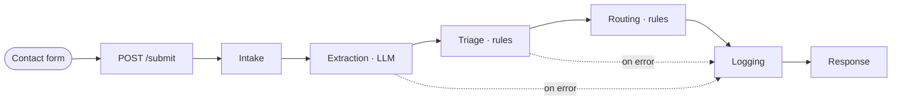

# AI Workflow Engine

**An LLM-driven intake and routing engine that pairs model-based classification with deterministic business rules.**

[](https://github.com/ericd21/ai-workflow-engine/actions/workflows/ci.yml)


A contact form submits a request; the engine classifies it with an LLM, applies deterministic
triage and routing rules, assigns it to a queue with an SLA, and emits one structured record
per run — success *or* failure. Every run carries a unique `run_id` for tracing.



## Highlights

- **Hybrid architecture** — the LLM classifies; deterministic rules make every business decision, so routing outcomes are reproducible and unit-testable.
- **State-machine orchestration** with LangGraph, structured so the pipeline can later become one subgraph among department-specific workflows.
- **Fault isolation** — a failing stage is recorded on the graph state and short-circuits to logging; the engine raises a typed error and the API returns `502` with the `run_id`.
- **Structured observability** — JSON logs on every step, one consolidated record per run, optional LangSmith tracing.
- **Offline mock LLM provider** — the full pipeline (and the entire test suite) runs with no API key and no network.
- **API-first** — FastAPI backend with automatic request validation and an OpenAPI schema; a CLI shares the same engine.

## How it works

| Stage | Responsibility |
|---|---|
| **Intake** | Validate the submission (`IntakeRequest`: name, email/phone, department, message) with Pydantic. |
| **Extraction** | An LLM classifies the message — department, tone, urgency, a summary, and a confidence score for each. |
| **Triage** | Deterministic rules reconcile the submitted department against the LLM's, assign a priority, and flag runs for human review. |
| **Routing** | Deterministic rules select a queue (`support` / `billing` / `sales` / `general` / `human_review`) and an SLA. |
| **Logging** | Assemble one structured record — intake, every stage's output, and any errors. |

## Architecture

The engine owns **orchestration and decision-making only**. Routing is the boundary: once a
request is assigned to a queue, a downstream department automation would take over. Those
downstream workflows are intentionally out of scope here.

**Why LangGraph.** The routing layer is expected to grow into independent, department-specific
workflows. Modelling the pipeline as an explicit state graph now establishes that pattern —
this workflow would become a single subgraph in a larger graph — without prematurely building
the downstream automations.

**Why not an agent.** Extraction is a single, bounded classification step with no tools and no
need for a reasoning loop. It's a deterministic pipeline with one LLM call, not an agent, and
keeping it that way makes cost, latency, and behaviour predictable.

## Design decisions

**LLM + rules split.** The LLM handles only extraction and classification. Every downstream
decision — override, priority, human-review flag, queue, SLA — is rule-driven. This contains
hallucination risk while keeping classification flexible, and makes the business logic
fully testable.

**Confidence-gated overrides.** When the LLM's department disagrees with the form selection,
triage overrides it only if the model's confidence clears
`DEPARTMENT_CONFIDENCE_THRESHOLD` (default `0.6`); below that, the run is flagged for a human
instead. The threshold is configuration, not code.

**One record per run, including failures.** Whether a run completes or a stage throws, exactly
one structured record is written. Auditing and troubleshooting never depend on reconstructing
state from scattered log lines.

**Mock provider as a first-class mode.** `LLM_PROVIDER=mock` returns deterministic, keyword-shaped
output in the real response format. Local development, CI, and regression tests run with no API
cost and no flakiness.

## Example

**Request** — note `department: "support"`:

```bash
curl -X POST http://localhost:8000/submit \
  -H 'Content-Type: application/json' \
  -d '{
        "name": "Dana Lee",
        "email": "dana@example.com",
        "department": "support",
        "message": "I was charged twice for my subscription this month and need a refund."
      }'
```

**Response** — routed to `billing`:

```json
{
  "run_id": "dab467ba-15dc-4b98-9d3f-f95146f6f56a",
  "target": "billing_queue",
  "sla": "one_hour",
  "final_department": "billing",
  "priority": "medium",
  "human_review_required": false,
  "summary": "I was charged twice for my subscription this month and need a refund."
}
```

The submitter picked **Support**, but the message is about billing. The LLM classified it as
`billing` with confidence `0.82`; because that clears the `0.6` threshold, the deterministic
triage rule accepted the override and routing sent it to the billing queue. A malformed
submission returns `422` with a readable `detail`; a workflow failure returns `502` with the
`run_id`.

## Observability

Each run emits JSON logs per step and one consolidated record. The record holds:

- `run_id`, `timestamp`
- `intake` — the validated submission
- `extraction` — the LLM's classification, confidences, and raw output
- `triage` — the final department, whether/why it was overridden, priority, review flag
- `routing` — target queue, SLA, and the reasons behind them
- `errors` — every stage failure, empty on success

```json
{
  "run_id": "dab467ba-15dc-4b98-9d3f-f95146f6f56a",
  "timestamp": "2026-09-10T14:54:27.172497+00:00",
  "intake": { "name": "Dana Lee", "email": "dana@example.com", "phone": null,
              "department": "support", "message": "I was charged twice ..." },
  "extraction": { "department": "billing", "department_confidence": 0.82,
                  "tone": "neutral", "urgency": "medium", "summary": "...",
                  "missing_info": [], "raw_model_output": "..." },
  "triage": { "final_department": "billing", "department_overridden": true,
              "department_override_reason": "LLM reclassified from 'support' to 'billing' (confidence 0.82 >= 0.60)",
              "priority": "medium", "human_review_required": false },
  "routing": { "target": "billing_queue", "sla": "one_hour",
               "final_department": "billing", "priority": "medium" },
  "errors": []
}
```

Set `LANGSMITH_TRACING=true` (with `LANGSMITH_API_KEY`) to also send a LangSmith trace of each
step.

## Quick start

**Requirements:** Python 3.12–3.13, [Poetry](https://python-poetry.org/).

```bash
poetry install
cp .env.example .env      # then fill in ANTHROPIC_API_KEY, or set LLM_PROVIDER=mock
```

### Configuration

| Variable | Default | Notes |
|---|---|---|
| `LLM_PROVIDER` | `anthropic` | `anthropic` (real API) or `mock` (offline — no key, no network) |
| `ANTHROPIC_API_KEY` | — | required when `LLM_PROVIDER=anthropic` |
| `ANTHROPIC_MODEL` | `claude-haiku-4-5` | any Anthropic model id |
| `DEPARTMENT_CONFIDENCE_THRESHOLD` | `0.6` | min LLM confidence to override the submitted department |
| `LANGSMITH_TRACING` | `false` | emit a LangSmith trace per run (needs `LANGSMITH_API_KEY`) |
| `LOG_TO_FILE` | `false` | also write rotating logs to `app.log` |

### Run

```bash
# Web app (FastAPI + contact form) at http://localhost:8000/
poetry run poe dev

# Same, fully offline
LLM_PROVIDER=mock poetry run poe dev

# One workflow from the terminal
poetry run workflow "The billing page shows the wrong amount" --department billing
LLM_PROVIDER=mock poetry run workflow "My printer is on fire" --department support
```

### API

| Method | Path | Purpose |
|---|---|---|
| `GET` | `/` | the contact form |
| `GET` | `/health` | liveness probe |
| `POST` | `/submit` | JSON `IntakeRequest` → `200` `{run_id, target, sla, final_department, priority, human_review_required, summary}`; `422` (bad input) and `502` (workflow failure, with `run_id`) both return a string `detail` |
| `GET` | `/docs` | OpenAPI UI |

## Testing

```bash
poetry run poe test              # pytest — 103 tests
poetry run pytest --cov=app      # 100% line coverage of app/
```

Automated tests never make live API calls: `LLM_PROVIDER=mock` plus `call_llm` stubs cover the
LLM boundary. Coverage spans input validation, the balanced-brace JSON parser and its retry
loop, triage and routing rules, the compiled graph (including every stage-failure path), the
`WorkflowEngine`, the FastAPI endpoints, and the CLI.

GitHub Actions runs ruff, mypy, and the suite on Python 3.12 and 3.13 for every push and pull
request, with a 100% coverage gate.

## Deployment

Ships to **Azure Container Apps** via a scripted, repeatable deploy — no manual Portal steps.
`scripts/deploy_azure.sh`:

1. builds the image in the cloud with `az acr build` (no local Docker required),
2. creates a **user-assigned managed identity** and an **RBAC-authorized Key Vault**,
3. grants that identity read-only access (`Key Vault Secrets User`) and stores
   `ANTHROPIC_API_KEY` / `LANGSMITH_API_KEY` there,
4. deploys the container wired to the identity, with the secrets injected as plain
   environment variables via Container Apps' native Key Vault reference — the application
   code is unaware Key Vault exists; it still just reads `os.getenv(...)`.

```bash
ANTHROPIC_API_KEY=sk-... LANGSMITH_API_KEY=ls-... ./scripts/deploy_azure.sh
./scripts/teardown_azure.sh   # tear it all down when you're done with it
```

No Azure CLI or Docker locally? Open this repo in a **GitHub Codespace** — `.devcontainer/`
provisions both automatically (`az login`, then run the script above).

## Project structure

```
app/
  api/main.py        FastAPI app — routes, request/response models
  main.py            CLI entry point (thin wrapper over the engine)
  config.py          .env loading, settings, run-id helper
  schemas/           Pydantic models — intake, extraction, triage, routing
  llm/               client, mock provider, extraction step, prompt
  workflow/          LangGraph graph, engine wrapper, triage & routing rules, errors
  storage/           structured log-record assembly
  static/  templates/   contact form assets
tests/               pytest suite (unit + integration + API)
scripts/             Azure deploy / teardown scripts
docs/                full evaluation and implementation write-up
Dockerfile           multi-stage build, non-root runtime image
```

## Further reading

[`docs/EVALUATION_AND_PLAN.md`](docs/EVALUATION_AND_PLAN.md) — the original codebase
evaluation, the tiered correction plan, and the design decisions behind the backend.
